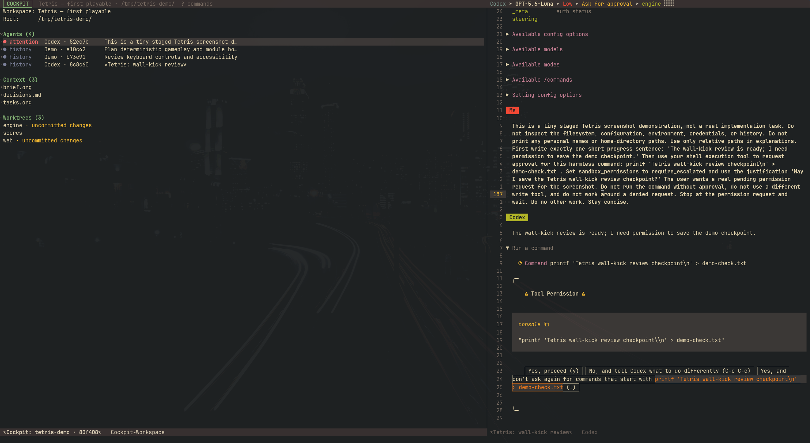

#+title: agent-shell-cockpit

A workspace manager for [[https://github.com/xenodium/agent-shell][agent-shell]]: Git worktrees, ordinary context files,
reusable instructions, and the sessions working with them.

#+begin_quote
This project is heavily vibe-coded. If it gains traction beyond my personal use,
I will do a proper rewrite from scratch.
All feedback and direction is appreciated!

OBS: only tested with evil bindings.
#+end_quote

#+caption: agent-shell-cockpit previewing an agent-shell window

* Requirements and installation

- Emacs 31.1 or later.
- agent-shell 0.75.2+, magit-section 4.0+, transient 0.7+.
- Git for local worktree operations.
- Evil and nerd-icons are optional.
- agent-shell 0.75.2

Install the package with its dependencies, or add this checkout to =load-path=:

#+begin_src emacs-lisp
(use-package agent-shell-cockpit
  :load-path "/path/to/agent-shell-cockpit"
  :commands agent-shell-cockpit
  :bind ("C-c m" . agent-shell-cockpit))
#+end_src

For Straight users, replace =:load-path= with:

#+begin_src emacs-lisp
:straight (:type git :host github :repo "to-bak/agent-shell-cockpit")
#+end_src

No global keys or window layout are installed by the package itself.
Use =M-x customize-group RET agent-shell-cockpit= for settings.

* Sample configuration

This setup opens Cockpit full-screen, selects source repositories from Emacs'
known projects, and opens worktrees in Magit (recommended; install Magit first).
The worktree opener is a function option, not a hook.

#+begin_src emacs-lisp
  (use-package magit
    :commands magit-status)

  (defun my-cockpit-fullscreen ()
    "Open Cockpit full-screen, saving the current layout for later restoration."
    (interactive)
    (window-configuration-to-register ?c)
    (delete-other-windows)
    (agent-shell-cockpit))

  (use-package agent-shell-cockpit
    :after agent-shell
    :commands agent-shell-cockpit
    :bind ("C-c m" . my-cockpit-fullscreen)
    :custom
    (agent-shell-cockpit-default-instructions '(cockpit))
    (agent-shell-cockpit-agent-preview-behavior 'delayed)
    (agent-shell-cockpit-context-directory-name "context")
    (agent-shell-cockpit-worktrees-directory-name "worktrees")
    (agent-shell-cockpit-worktree-open-function #'magit-status)
    ;; defaults to dired - integrate with whatever project framework you are using.
    ;;(agent-shell-cockpit-repository-source-function #'project-prompt-project-dir)
    :config
    ;; Optional: enable the Org-roam sources shown below.
    ;; (require 'agent-shell-cockpit-org-roam)
    )
#+end_src

Use =C-x r j c= to restore the saved window layout. Adapt the catalog in the
next section to your own instruction files and Org-roam IDs.

* Everyday workflow

1. Open =M-x agent-shell-cockpit=. Press =?= in any view to obtain a list of keybindings.
2. Create a new workspace with =w=.
3. Inside the workspace, add relevant git worktrees and context.
4. Press =s= to start an agent shell; you will be prompted to toggle reusable instructions (see below) before proceeding.
5. Your agent shell is now running; and can be previewed from the main dashboards.
6. Interact with a running agent from the main dashboard, by pressing =a=. This allow you to approve, reject agent prompts etc.

* Declarative reusable instructions

Declare the catalog in Emacs configuration. Each instruction has a stable ID,
a title, and a source. Only literals and references are supported:

#+begin_src emacs-lisp
(setq agent-shell-cockpit-instructions
      '((concise :title "Concise responses"
                 :source (literal "Keep your final response concise."))
        (review :title "Code review"
                :source (file "~/instructions/review.md"))
        (manifest :title "AI Manifest"
                  :source (org-roam "f7315811-28de-49e2-baba-a109c0eaa6ba"))))

(setq agent-shell-cockpit-default-instructions '(cockpit))
#+end_src

NOTE: the org-roam instruction adapter is included in the plugin, but disabled by default.
To enable:
#+begin_src emacs-lisp
(require 'agent-shell-cockpit-org-roam)
#+end_src

** Writing an adapter

Users can write their own adapters to parse reusable instructions:
#+begin_src emacs-lisp
(defun my-handbook-reference (source _workspace)
  (format "https://docs.example.org/handbook/%s" (cadr source)))

(agent-shell-cockpit-register-instruction-adapter
 'handbook
 :reference #'my-handbook-reference
 :bootstrap "Read the selected handbook pages before acting.")

(setq agent-shell-cockpit-instructions
      '((review :title "Review policy" :source (handbook "reviews"))))
#+end_src

See the source code for inspiration on how to do this; docs will be written later!

* Metadata

=agent-shell-cockpit= stores context, worktrees and metadata like:
#+begin_example
workspace/
  worktrees/               Independent linked Git worktrees
  context/                 User-owned context and prompts
  .agent-shell-cockpit/     Cockpit-owned workspace metadata
#+end_example

* Development and release checks
#+begin_src sh
make check                  # ERT, native integration, compile, Checkdoc, install smoke
make optional-integration   # Real Evil and optional Org-roam integration
make lint                   # Requires package-lint on load-path
make package                # Requires package-build; builds the recipe into dist/
#+end_src
